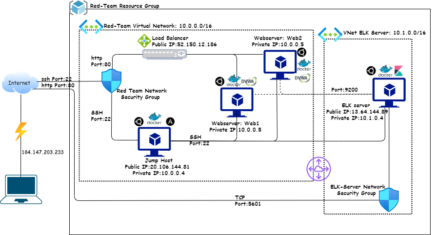

# Cybersecurity-Project-1-
Automated ELK Stack Deployment
The files in this repository were used to configure the network depicted below.

These files have been tested and used to generate a live ELK deployment on Azure. They can be used to either recreate the entire deployment pictured above. Alternatively, select portions of the playbook file may be used to install only certain pieces of it, such as Filebeat.
- [Playbooks/filebeat-playbook.yml](filebeat-playbook.yml)

#### This document contains the following details:
- Description of the Topologu
- Access Policies
- ELK Configuration
  - Beats in Use
  - Machines Being Monitored
- How to Use the Ansible Build

### Description of the Topology
The main purpose of this network is to expose a load-balanced and monitored instance of DVWA, the D*mn Vulnerable Web Application.
Load balancing ensures that the application will be highly **relaiable**, in addition to restricting **traffic** to the network.
- The load balancer acts as the “traffic cop” sitting in front of the web servers, routing incoming traffic requests across all web servers attached to it distributing network traffic efficiently. This maximizes speed and capacity utilization while ensuring that none of the servers are overloaded. This also helps prevent against denial of service attacks where if a web server goes down or is overloaded with requests, the load balancer redirects traffic to the remaining web servers attached to. Also When a new server is added to the server group, the load balancer automatically starts to send requests to it increaseing scalability and flexibility of adding or removing servers as required.
- The jump box provides a point of entry into the virtual network from which we can connect to other servers, this increases security of the virtual network by greatly reducing the virtual network attack surface as it eliminates direct traffic from the internet. The jump host also makes it easier to log all the attempts and take necessary measures for failing attempts.  

Integrating an ELK server allows users to easily monitor the vulnerable VMs for changes to the **logs** and system **metrics and statistics**
