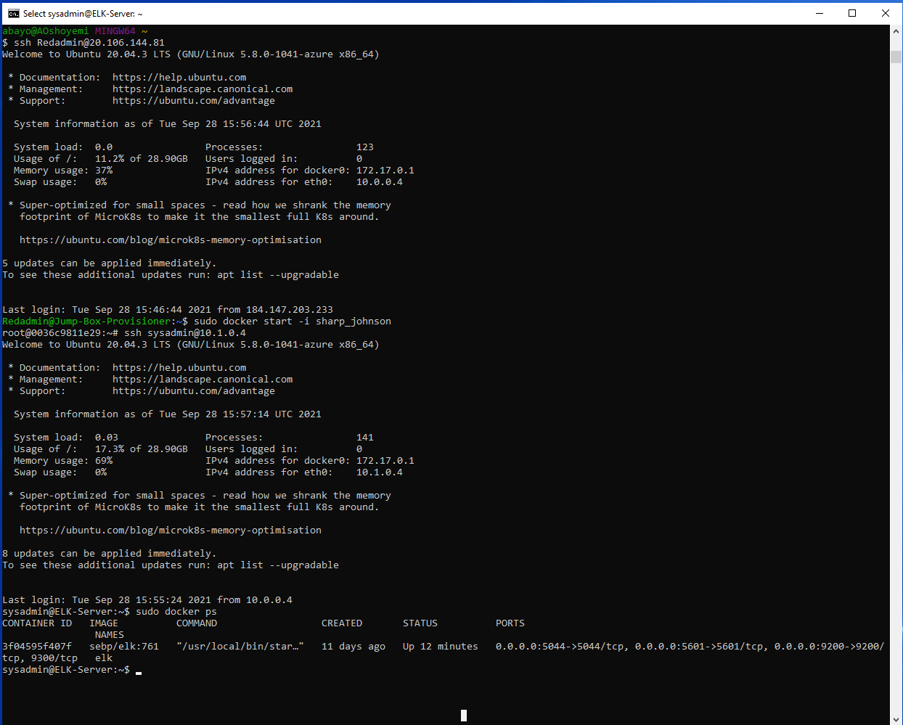

# Cybersecurity-Project-1-
Automated ELK Stack Deployment
The files in this repository were used to configure the network depicted below.

These files have been tested and used to generate a live ELK deployment on Azure. They can be used to either recreate the entire deployment pictured above. Alternatively, select portions of the playbook file may be used to install only certain pieces of it, such as Filebeat.
- [Playbooks/filebeat-playbook.yml](filebeat-playbook.yml)

#### This document contains the following details:
- Description of the Topology
- Access Policies
- ELK Configuration
  - Beats in Use
  - Machines Being Monitored
- How to Use the Ansible Build

### Description of the Topology
The main purpose of this network is to expose a load-balanced and monitored instance of DVWA, the D*mn Vulnerable Web Application.
Load balancing ensures that the application will be highly **relaiable**, in addition to restricting **traffic** to the network.
- The load balancer acts as the “traffic cop” sitting in front of the web servers, routing incoming traffic requests across all web servers attached to it distributing network traffic efficiently. This maximizes speed and capacity utilization while ensuring that none of the servers are overloaded. This also helps prevent against denial of service attacks where if a web server goes down or is overloaded with requests, the load balancer redirects traffic to the remaining web servers attached to. Also When a new server is added to the server group, the load balancer automatically starts to send requests to it increaseing scalability and flexibility of adding or removing servers as required.
- The jump box provides a point of entry into the virtual network from which we can connect to other servers, this increases security of the virtual network by greatly reducing the virtual network attack surface as it eliminates direct traffic from the internet. The jump host also makes it easier to log all the attempts and take necessary measures for failing attempts.  

Integrating an ELK server allows users to easily monitor the vulnerable VMs for changes to the **logs** and system **metrics and statistics**
- Filebeat fowards and centralize log data: File beat is installed as an agent on the webservers where it monitors the log files, it then collects the log events and sends them to Elasticsearch or logstash for indexing.
- Metricbeat on the other hand collects system metrics and statistics and fowards them to speciied output in this case Elasticsearch and logstash, Installed on web1 and web2, metricbeat will help monitor the webservers by collecting metrics from the system and services running on the server. Metricbeat log files are visualized with Kibana dashboard.

The configuration details of each machine may be found below.
_Note: Use the [Markdown Table Generator](http://www.tablesgenerator.com/markdown_tables) to add/remove values from the table_.

| Name     | Function | IP Address | Operating System |
|------------|-------------|------------|----------------|
| Jump Box   | Gateway     | 10.0.0.4   | Linux          |
| Web1       | Webserver 1 | 10.0.0.5   | Linux          |
| Web2       | Webserver 2 | 10.0.0.6   | Linux          |
| ElK Server | Elk Server  | 10.1.0.4   | Linux          |

### Access Policies
The machines on the internal network are not exposed to the public Internet. 
Only the jumpbox virtual machine can accept connections from the Internet. Access to this machine is only allowed from the following IP addresses:
- My home network IP address: 184.147.203.233

Machines within the network can only be accessed by my local workstation via the jumpbox virtual machine and the ELK over the internet  
- Access to ELK server with in the virtual network: via jump host: IP address: 10.0.0.4,
- Access to the ELK server from outside the virtual network: My home network IP address: 184.147.203.233

A summary of the access policies in place can be found in the table below.

| Name     | Publicly Accessible | Allowed IP Addresses        |
|----------|---------------------|-----------------------------|
| Jump Box | Yes                 | Home IP: 184.147.203.233    |
| web1     | No                  | 10.0.0.4                    |
| web2     | No                  | 10.0.0.4                    |
| ELK      | Yes                 | Home IP: 184.147.203.233    |

### Elk Configuration
Ansible was used to automate configuration of the ELK machine. No configuration was performed manually, which is advantageous because...
- Ansible provides the automation platform for configuration management and application deployment on multiple infrastructure  
  basically as single ansible playbook can be used for configuration management and application deployment multiple servers 
- Ansible uses no agents and no additional custom security infrastructure, so it's easy to deploy, also it uses a very simple language YAML (Ansible Playbooks) that allows the description of automation jobs in plan English 

The playbook implements the following tasks:
 * Install Docker.io 
    - name: Install docker.io
      apt:
        update_cache: yes
        force_apt_get: yes
        name: docker.io
        state: present
        
* Install Pythonm pip 
    - name: Install python3-pip
      apt:
        force_apt_get: yes
        name: python3-pip
        state: present

* Install Docker Module
    - name: Install Docker module
      pip:
        name: docker
        state: present

* Increase virtual memory 
    - name: Use more memory
      sysctl:
        name: vm.max_map_count
        value: '262144'
        state: present
        reload: yes 

* Use docker_container module
    - name: download and launch a docker elk container
      docker_container:
        name: elk
        image: sebp/elk:761
        state: started
        restart_policy: always
* Please list the ports that ELK runs on
        published_ports:
          -  5601:5601
          -  9200:9200
          -  5044:5044

* Use systemd module
    - name: Enable service docker on boot
      systemd:
        name: docker
        enabled: yes

The following screenshot displays the result of running `docker ps` after successfully configuring the ELK instance.

### Target Machines & Beats
This ELK server is configured to monitor the following machines:
- Webserver 1: 10.0.0.5
- Webserver 2: 10.0.0.6

We have installed the following Beats on these machines:
- Filebeats and Metricbeats 

These Beats allow us to collect the following information from each machine:
- Filebeat monitors the log files or locations specified for the logs, collects log events, and forwards them either to Elasticsearch or Logstash for indexing, log types collected includes audit logs
- Metricbeat on the other hand installed periodically collect metric data from your target servers, this included operating system metrics such as CPU or memory or data related to services running on the server. It can also be used to monitor other beats and ELK stack itself.

